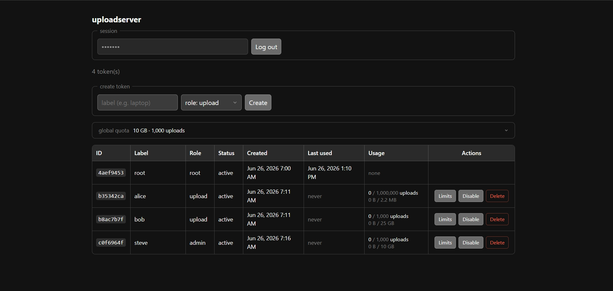

# uploadserver

A small upload endpoint I run on my home server so ShareX can drop files into
a plain folder and get a link back.

The reason it exists is that I was tired of S3 keeping all my uploads as opaque
blobs when all I wanted was the real file sitting in a directory I can open and
serve myself. ShareX could do this over SFTP, but I'd rather not expose that on
a box at home, and a plain HTTP endpoint feels cleaner anyway. So this is the
piece in between. It checks a token, writes the upload to disk under a random
name, and returns the URL.

It picked up a few things along the way like token auth so I can hand out
separate keys, quotas so one key can't eat the whole disk, and a small admin
page to manage all of it.



## Installation

### Docker

There's a published image at `ghcr.io/skidoodle/uploadserver`. Grab
`compose.yaml` from the repo, set the environment how you want, and bring it up:

```sh
docker compose up -d
```

Uploads go to the `data` volume, tokens to the `state` volume.

### Binary

Releases has prebuilt Linux/amd64 tarballs. Download the latest one, extract, run.

### Source

```sh
git clone https://github.com/skidoodle/uploadserver
cd uploadserver
go build -o uploadserver .
```

## How to use

The first run prints a root token once. Save it, that's your admin login:

```console
$ uploadserver run
uploadserver: (default root token: Xq3...9fZ - saved to ./state/tokens.db)
uploadserver: listening on :8080, storing uploads in ./data
```

Make an upload token for ShareX from the dashboard: open the server's URL and
log in with the root token. The CLI does the same, but only while the server is
stopped — the token store is a bbolt database and the running server holds it
open, so a CLI command run alongside it exits with a "locked" message. Manage
tokens through the dashboard while the server is up, and reach for the CLI when
it's down:

```console
$ uploadserver add --label laptop --role upload
created upload token a1b2c3d4
secret (shown once): <your-upload-token>
```

Then import `uploadserver.sxcu` into ShareX, set the URL to your domain, and
drop the token into the Authorization header. A plain curl does the same job:

```console
$ curl -H "Authorization: Bearer <token>" -F "file=@cat.png" https://u.example.com/
https://u.example.com/a1b2c3d4.png
```

The link is `BASE_URL` plus the random filename. uploadserver writes the files
but doesn't serve them, so point your web server at the upload folder (nginx,
caddy, whatever) and set `BASE_URL` to wherever that lands.

## CLI

```text
$ uploadserver
usage: uploadserver <command> [<args>]

Commands:
  run                        Start the web server
  list                       List all tokens, with usage and quotas
  add [--label L] [--role R] Create a new token
  rm <id>                    Delete a token
  disable <id>               Disable a token
  enable <id>                Enable a token
  limit <id> [flags]         Set upload quotas for a token
  global [flags]             Show or set the server-wide default quota
  dump                       Decode the binary store and print everything in it
  reset                      Delete all tokens and reset store
```

`limit` and `global` take the quota flags:

```text
--total-size 5GB       Lifetime size cap (B/KB/MB/GB/TB; 0 clears it)
--total-uploads 1000   Lifetime upload-count cap
--monthly-size 5GB     Size cap per calendar month
--monthly-uploads 500  Upload-count cap per calendar month
```

`limit` also has `--bypass` to exempt a token from all quotas and `--clear` to
wipe its caps. Only the flags you pass get changed.

## Configuration

Everything is set through environment variables:

| Variable | Description | Default |
| --- | --- | --- |
| `LISTEN_ADDR` | Address to listen on | `:8080` |
| `UPLOAD_DIR` | Directory uploads are written to | `./data` |
| `BASE_URL` | Public URL prefix for returned links | the request's host |
| `UPLOAD_FIELD` | Multipart form field name | `file` |
| `TOKEN_STORE` | Path to the bbolt token database | `./state/tokens.db` |
| `MAX_UPLOAD_BYTES` | Max upload size in bytes | `1073741824` (1 GiB) |
| `RANDOM_NAME_LENGTH` | Length of the random filename in hex chars | `32` |
| `STRIP_EXTENSION` | Drop the file extension from returned URLs | `false` |
| `ENABLE_ADMIN` | Mount the admin dashboard and API | `true` |
| `SERVE_FILES` | Serve uploaded files | `false` |
